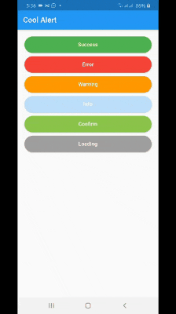

# cool_alert

A Flutter package to display animated alert dialogs

## Usage

To use this package, add cool_alert as a dependency in your pubspec.yaml file.
And add this import to your file.

import 'package:cool_alert/cool_alert.dart';

## Image


### Example

```
CoolAlert.show(
   context: context,
   type: CoolAlertType.success,
   text: "Your transaction was successful!",
);
```


### CoolAlert Class

| Attribute        | Data type           | Description                                                                                                                                                   |            Default Value            |
|:----------------------|:-------------------|:--------------------------------------------------------------------------------------------------------------------------------------------------------------|:-----------------------------------:|
| context| BuildContext | @required                                                                                      |                Null                 |
| type | CoolAlertType | @required - Type of alert dialog, ex: CoolAlertType.success for success dialogs | Null
title| String | Set a custom title for dialog                                                                                                |                Based on the CoolAlertType selected|                 |
| text| String             | Set the description text of the dialog.                                                                                                                       |                Null                 |
| confirmBtnText | String             | Text of confirm button                                                                                                                                       |                'Ok'                 |                 |
| confirmBtnTap| Function           | Function that handle click of confirm button                                                                       |                () => Navigator.pop(context)|
| confirmBtnColor| Color              | Color of confirm Button                                                                                                                                       |          Theme.of(context).primaryColor          |                |
| cancelBtnText| String             | Text of cancel button                                                                                                                                       |              'Cancel'               |
| cancelBtnTap| Function           | Function that handle click of cancel button                                                                     |                () => Navigator.pop(context) 
| barrierDismissible| bool               | Dissmiss dialog on touch overlay                                                                                                                              |                true                 
| animType              | CoolAlertAnimType| Type of dialogue enter animation                                                                                                                              |           CoolAlertAnimType.scale|
| backgroundColor              | Color| Background color of the animation                                                                                                                              |           Color(0xFF515C6F)|
| confirmBtnTextStyle              | TextStyle | Confirm button text theme                                                                                                                              |           TextStyle(color: Colors.white, fontWeight:FontWeight.w600,fontSize: 18.0)|
| cancelBtnTextStyle              | TextStyle | Cancel button text theme                                                                                                                             |           TextStyle(color: Colors.grey, fontWeight:FontWeight.w600,fontSize: 18.0)|
| flareAsset              | String | Custom flare asset                                                                                                                             |           "animation.flr" |
| flareAnimationName              | String | The name of the flare animation to play                                                                                                                             |           "play" |
| lottieAsset              | String | Custom lottie asset                                                                                                                             |           "animation.json" |


